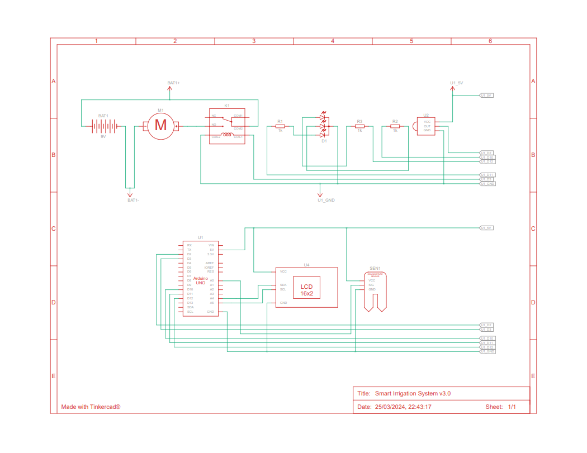

# Sistema de Rega Automatizado

Este projeto é um sistema de rega automatizado baseado em Arduino. Ele utiliza um sensor de umidade do solo para determinar quando a rega é necessária e um relé para controlar a válvula de água. O sistema também inclui um display LCD para exibir informações sobre o estado atual do sistema e um controle remoto infravermelho para ajustar as configurações.

## Requisitos

- Arduino (este código foi testado com um Arduino Uno)
- Sensor de umidade do solo
- Relé
- Display LCD I2C
- Controle remoto infravermelho
- LEDs (vermelho, verde e azul)
- Bibliotecas Arduino: `IRremote`, `Wire`, `LiquidCrystal_I2C`

## Instalação

1. Conecte o sensor de umidade do solo, o relé, o display LCD e os LEDs ao seu Arduino conforme necessário. A imagem abaixo fornece um esquema de como conectar os componentes:

  

2. Instale as bibliotecas Arduino necessárias usando o Gerenciador de Bibliotecas no IDE do Arduino.
3. Carregue o código fornecido para o seu Arduino.

## Primeiros Passos

Após a instalação e configuração inicial do sistema, siga os passos abaixo para configurar o horário e as horas de funcionamento do sistema de rega:

1. Navegue até o menu de configuração de hora no display LCD usando os botões Up/Down do controle remoto infravermelho.

2. Defina a hora atual usando os botões numéricos do controle remoto. Certifique-se de inserir a hora no formato correto (24 horas).

3. Após definir a hora atual, navegue até o menu de hora mínima. Esta é a hora a partir da qual o sistema de rega pode começar a funcionar.

4. Defina a hora mínima usando os botões numéricos do controle remoto, da mesma forma que fez para a hora atual.

5. Em seguida, navegue até o menu de hora máxima. Esta é a hora até a qual o sistema de rega pode funcionar.

6. Defina a hora máxima usando os botões numéricos do controle remoto, da mesma forma que fez para a hora atual e a hora mínima.

Com essas configurações, o sistema de rega automatizado só irá funcionar entre as horas mínima e máxima que você definiu, ajudando a economizar água e energia. Lembre-se de que você pode ajustar essas configurações a qualquer momento conforme necessário.

## Uso

O sistema de rega automatizado irá monitorar a umidade do solo e ligar a válvula de água quando a umidade cair abaixo de um certo limite. Este limite pode ser ajustado usando o controle remoto infravermelho.

O display LCD exibirá informações sobre o estado atual do sistema, incluindo a umidade atual do solo e o limite de umidade. Ele também exibirá um menu que permite ajustar as configurações do sistema.

O controle remoto infravermelho pode ser usado para navegar pelo menu e ajustar as configurações. As funções dos botões do controle remoto são as seguintes:

- Power: Liga/desliga o sistema
- Up/Down: Navega entre as paginas do menu
- 0-9: Insere valores no menu
- Pause-Break: Reinicia o sistema
- Func-Stop: Exibe informações sobre o sistema
 
 ## Simulação Tinkercad

Para visualizar e interagir com o sistema de rega automatizado em um ambiente simulado, visite o projeto no Tinkercad através do seguinte link:

[Tinkercad - Sistema de Rega Automatizado](https://www.tinkercad.com/things/1uy7T2PSWqz-smart-irrigation-system-v30)